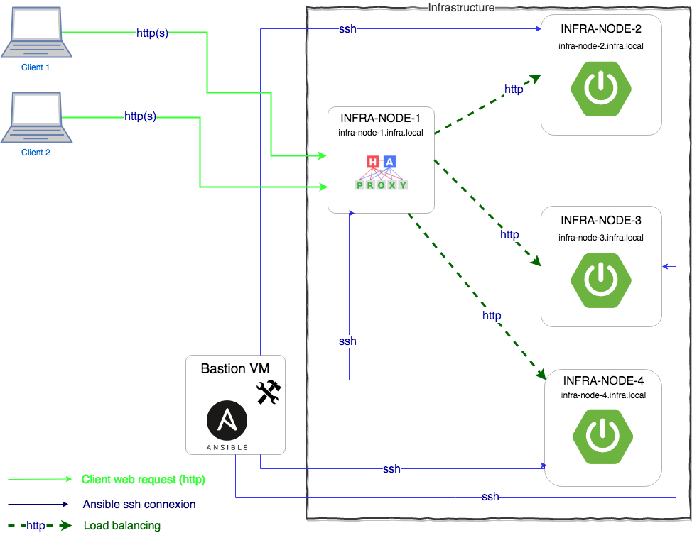

# learn-ansible

## Notre objectif

L'objectif de ce tutorial est d'apprendre à installer une infrastructure complexe grâce à [Ansible](https://docs.ansible.com/ansible/latest/index.html).

## Architecture technique cible

Notre infracstructure sera composé de 5 VMs réparties comme suit:

- **1 x BASTION:** Cette VM va nous servir de point d'accès aux autres machines de l'infra. Ansible sera installé et exécuté sur cette VM.
- **3 x VMs applicatives:** Sur les quelles nous allons installer une application [Spring-Boot](https://spring.io/projects/spring-boot) qui exposera des endpoints REST.
- **1 x VM [HAProxy](http://www.haproxy.org/):** Nous servira de load balancer (Front end) pour les clients.



## Step 1: Installation de l'environement


### Vagrant

Nous allons utiliser Vagrant pour simuler (par virtualisation) notre infrastructure

#### Installation de Vagrant

#### Plugins à installer

- *vagrant-vbguest* (conseillé) `vagrant plugin install vagrant-vbguest`
- *vagrant-env* (conseillé) `vagrant plugin install vagrant-env`
- *vagrant-timezone* (conseillé) `vagrant plugin install vagrant-timezone`
- *vagrant-proxyconf* (si vous êtes derrière un proxy d'entreprise) `vagrant plugin install vagrant-proxyconf`

#### Démarrer notre infrastructure

```sh
# Dupliquer le fichier .env afin de pouvoir le customiser
cp .env.template .env
# Vérifier les VMs qui vont être crées
vagrant status
# Démarrer les instances
vagrant up

# Se connecter en ssh sur le noeud BASTION
vagrant ssh BASTION-NODE
```

Essayez de contacter les noeuds de l'infra (depuis la VM BASTION) pour vérifier le setup

## Step 2: Installer Ansible sur le  BASTION

### Installer le repo epel-release

```sh
yum --enablerepo=extras install -y epel-release
```

### installation de *pip*

```sh
yum -y install -y python-pip
```

### Installation de Ansible

```sh
pip install ansible
```

### Tester l'infrastructure avec Ansible

Nous allons exécuter un `ping` sur tous les noeuds que nous avons dans notre infra.

#### Ping de localhost avec Ansible

```sh
ansible -m ping localhost
```

#### Créer l'inventaire des serveurs dans le fichier /etc/ansible/hosts (fichier inventaire par défaut)

```sh
mkdir /etc/ansible
cat > /etc/ansible/hosts <<EOF

# Default User and password to use
[all:vars]
ansible_user = root
ansible_ssh_pass= vagrant

# Ce group n'est pas obligatoire, il est nécessaire seulement si aucun autre groupe n'est définit
[all]
infra-node-1.infra.local
infra-node-2.infra.local
# Rajoutez autant de serveur que vous en avez

# Permet de cibler uniquement les serveurs du groupe A
[groupA]
infra-node-1.infra.local

# Permet de cibler uniquement les serveurs du groupe B
[groupB]
infra-node-2.infra.local

EOF

cat > ~/.ansible.cfg <<EOF

[defaults]
host_key_checking = False

EOF
```

#### Ping l'ensemble des serveurs avec Ansible

```sh
ansible -m ping  all
```

Le mot de pass root par defaut est `vagrant`. Oui Ansible à besoin des information d'authentification pour pouvoir se connecter en SSH sur les noeuds de notre infrastructure.
Il y'a plusieurs façon de s'authentifier en ssh:

- **user/password**: c'est ma méthode que nous allons utiliser pour faire simple
- **certificats (private/public key)**: Dans la vraie vie vous allez plutôt utiliser des certificats pour vous connecter à vos différents serveurs. Ce n'est pas l'objectif de ce tutorial


Le résultat attendue est le suivant (l'ordre des serveurs n'est pas important):

```sh
[root@bastion ~]# ansible -m ping  all
infra-node-2.infra.local | SUCCESS => {
    "changed": false,
    "ping": "pong"
}
infra-node-1.infra.local | SUCCESS => {
    "changed": false,
    "ping": "pong"
}
[root@bastion ~]#
```

#### Autres exemples de commandes à lancer sur tous nos serveurs

##### Voir la mémoire disponible sur tous les serveurs

```sh
ansible -a "/bin/sh -c 'free -h'"  all
# ou
ansible -m command -a "free -h"  all
# ou pour cibler uniquement un groupe
ansible -m command -a "free -h"  groupA
```

##### Voir l'espace disque disponible sur tous les serveurs

```sh
ansible -a "/bin/sh -c 'df -h'"  all
# ou
ansible -m command -a "df -h"  all
# ou pour cibler uniquement un groupe
ansible -m command -a "df -h"  groupA
```